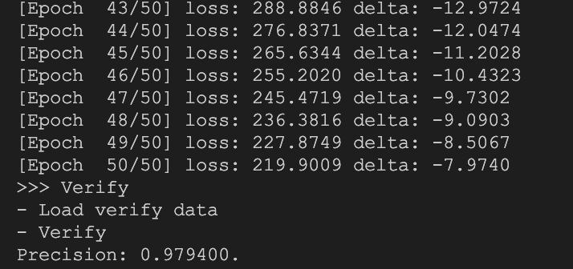

# BPNN Digit Recognizer

[中文简体 | [**English**](README.md)]

> This document was translated by AI.

An MNIST handwritten digit recognition example based on the BPNN library, covering the complete training and inference pipeline.

## Network Architecture

Using the MNIST handwritten digit dataset (10 classes: 0–9):

| Layer | Nodes |
| --- | --- |
| Input | 784 (28×28 pixels) |
| Hidden | 128 |
| Output | 10 |

## Dataset

All images are 28×28 grayscale, pixel values stored as `uint8_t`, files in IDX binary format.

| File | Description | Count |
| --- | --- | --- |
| `train-images-idx3-ubyte` | Training images (skip first 16 bytes, then 784 bytes per image) | 60,000 |
| `train-labels-idx1-ubyte` | Training labels (skip first 8 bytes, then 1 byte per label, value 0–9) | 60,000 |
| `t10k-images-idx3-ubyte` | Test images (same format as training set) | 10,000 |
| `t10k-labels-idx1-ubyte` | Test labels (same format as training set) | 10,000 |

Extract the archives under `data_set/` before use.

## Results

After 50 training epochs, the model achieves **97%** accuracy on the test set.

---

> This document was translated by AI.
