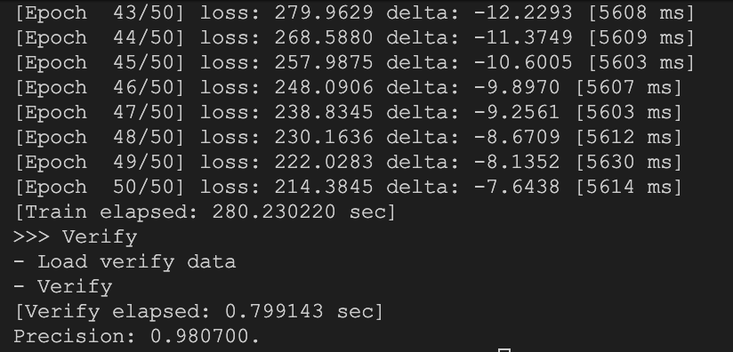
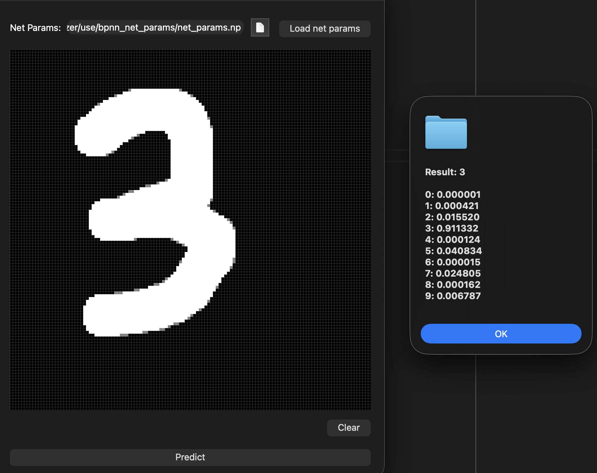

# BPNN Digit Recognizer

[[中文简体](README.md) | **English**]

> This document was translated by AI.

An MNIST handwritten digit recognition example based on the BPNN library, covering the complete training and inference pipeline.

## Network Architecture

Using the MNIST handwritten digit dataset (10 classes: 0–9):

| Layer | Nodes |
| --- | --- |
| Input | 784 (28×28 pixels) |
| Hidden | 128 |
| Output | 10 |

## Dataset

All images are 28×28 grayscale, pixel values stored as `uint8_t`, files in IDX binary format.

| File | Description | Count |
| --- | --- | --- |
| `train-images-idx3-ubyte` | Training images (skip first 16 bytes, then 784 bytes per image) | 60,000 |
| `train-labels-idx1-ubyte` | Training labels (skip first 8 bytes, then 1 byte per label, value 0–9) | 60,000 |
| `t10k-images-idx3-ubyte` | Test images (same format as training set) | 10,000 |
| `t10k-labels-idx1-ubyte` | Test labels (same format as training set) | 10,000 |

## Build

> Before building, extract the archives in the `data_set/` directory.

By default, only the model training and testing module is built.

```sh
cmake -B build
cmake --build build -j --config=Release
```

To build the **Digit Recognizer GUI**, ensure **Qt** (Qt5 or Qt6) is available in the build environment.

```sh
cmake -B build -DBUILD_DIGIT_RECOGNIZER_GUI=ON
cmake --build build -j --config=Release
```

## Usage

1. Run the model training program to train, test, and save the model.
2. Run the GUI application, load the trained model file, and recognize handwritten digits.

> A pre-trained model file is available in the `models/` directory and can be loaded directly by the GUI.

## Results

After 50 epochs, the model achieves **98%** accuracy on the test set. Training takes approximately five minutes.



